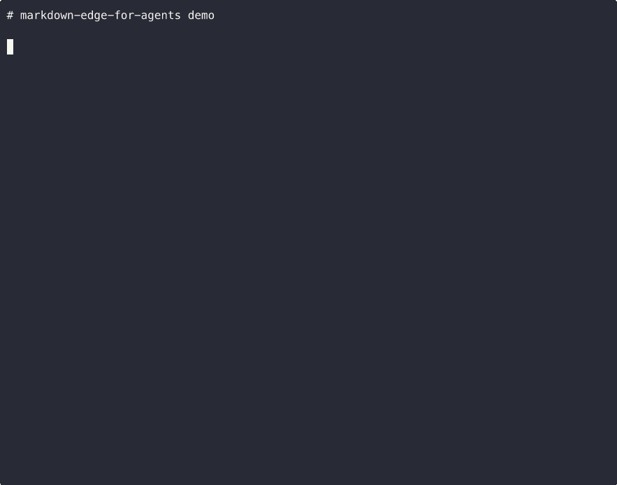

# Markdown Edge for Agents

[](https://github.com/adhenawer/markdown-edge-for-agents/actions/workflows/ci.yml)
[](./LICENSE)
[](#roadmap)
[](https://npmjs.com/package/@adhenawer-pkg/markdown-edge-for-agents)

> Markdown for Agents, on any Edge. Free tier ready.

Drop-in open-source alternative to Cloudflare's [Markdown for Agents](https://blog.cloudflare.com/markdown-for-agents/) feature (Pro+ only). Serves markdown to AI agents via content negotiation, 1:1 compatible with the official API.



## Quick start

```bash
npx create-markdown-edge-for-agents init
```

Detects your framework (Astro, Hugo, or custom), generates the worker + wrangler.toml, installs deps, and points you to deploy.

## Why

- Cloudflare's "Markdown for Agents" costs $25/mo (Pro) per zone
- Indie hackers on the Free tier are left out
- Existing OSS workers lack 1-command DX and 1:1 compatibility with the official API

## Usage as a lib

```ts
import { createMarkdownWorker } from "@adhenawer-pkg/markdown-edge-for-agents";

export default createMarkdownWorker({
  preset: "custom",
  selector: "article",
  strip: [".ad", "nav", "footer"],
});
```

## Presets

| Preset | Selector | Strip |
|---|---|---|
| `astro` | `article, main[data-page-type='post'], main.content` | nav, header, footer, aside, script, style, [aria-hidden] |
| `hugo` | `article, main .post-content, main.single` | nav, header.site-header, footer, .post-nav, .social-share |
| `custom` | `article` | (empty — you define it) |

## Config

| Option | Type | Default | Description |
|---|---|---|---|
| `preset` | `"astro" \| "hugo" \| "custom"` | **required** | Config base |
| `selector` | `string` | from preset | CSS selector for the content area |
| `strip` | `string[]` | from preset | Selectors to remove before converting |
| `frontmatter` | `string[]` | `["title","author","description","lang"]` | Fields in YAML frontmatter |
| `redirects` | `Record<string,string>` | `{}` | 301 redirects before negotiation |
| `forceMarkdownForUserAgents` | `RegExp[]` | `[]` | UA patterns that force markdown |
| `autoDetectAiCrawlers` | `boolean` | `false` | Auto-serve markdown to 16 known AI bots |
| `cache` | `{maxAge,staleWhileRevalidate}` | `{3600,86400}` | Cache headers |
| `debug` | `boolean` | `false` | Extra debug headers |

## AI crawler auto-detection

Most AI crawlers **don't send `Accept: text/markdown`**. Cloudflare Pro only responds to that header — making it nearly useless in practice ([research](https://dri.es/markdown-llms-txt-and-ai-crawlers): 0 real AI crawler requests used the header).

One line fixes this:

```ts
export default createMarkdownWorker({
  preset: "astro",
  autoDetectAiCrawlers: true, // GPTBot, ClaudeBot, PerplexityBot, etc.
});
```

16 bots detected out of the box: GPTBot, ChatGPT-User, OAI-SearchBot, ClaudeBot, Claude-Web, anthropic-ai, Google-Extended, Googlebot-AI, PerplexityBot, Applebot-Extended, cohere-ai, Meta-ExternalAgent, FacebookExternalHit, Amazonbot, CCBot, Bytespider, bingbot, YouBot.

Full list exported as `KNOWN_AI_CRAWLERS` for transparency. See [core README](./packages/core/README.md#ai-crawler-auto-detection) for details.

## Comparison with Cloudflare Pro

| Feature | Cloudflare Pro | markdown-edge-for-agents |
|---|---|---|
| Content negotiation via `Accept` | Yes | Yes |
| Auto-detect AI crawlers by User-Agent | **No** | **Yes (16 bots)** |
| `x-markdown-tokens` header | Yes | Yes |
| `Content-Signal` header | Yes | Yes |
| `Vary: Accept` caching | Yes | Yes |
| Price | $25/mo per zone | Free |
| Customization | Limited | Full |

## Roadmap

- v1.x: CF Workers only
- v2.x: Multi-runtime (Vercel Edge, Deno Deploy, Bun, Node)
- Community: more presets (Jekyll, 11ty, Next.js, Ghost)

## Contributing

See [CONTRIBUTING.md](./CONTRIBUTING.md). TDD is mandatory.

## License

MIT
